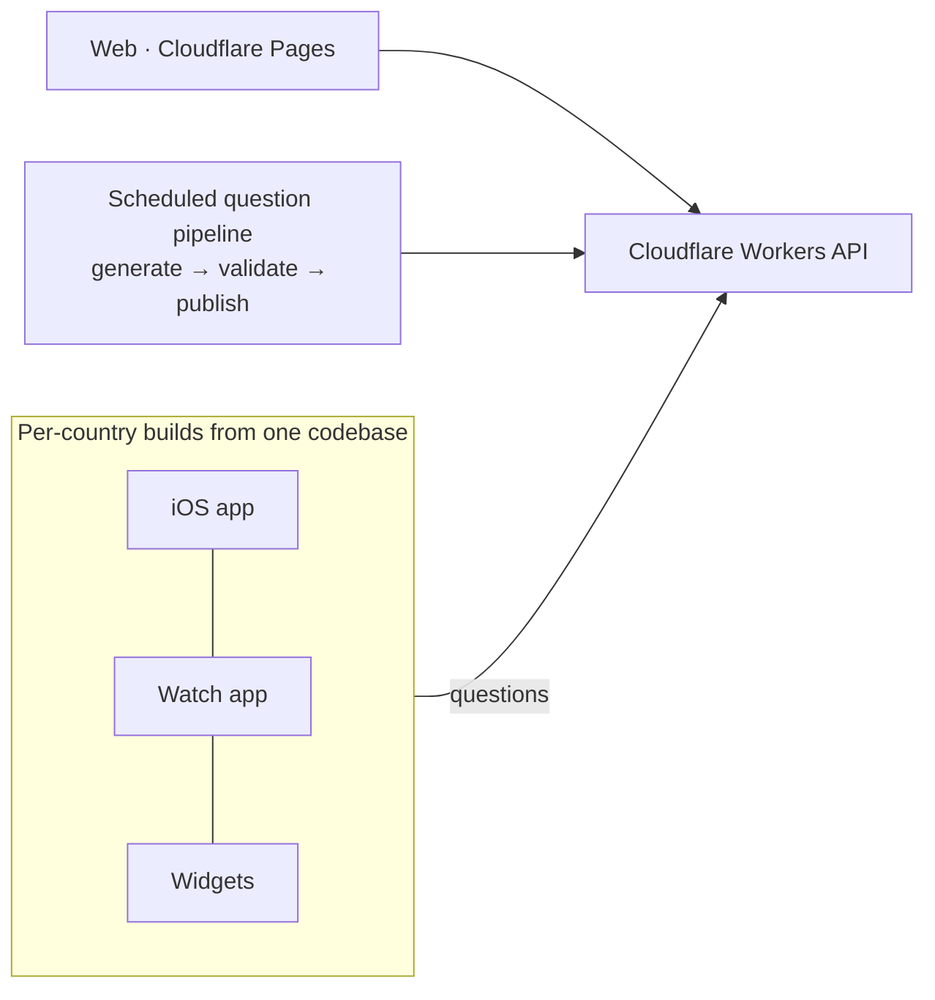

# Architecture

## Key decisions

| Decision | Why |
|---|---|
| Per-country apps instead of one big app | Stronger local branding and App Store search, and each market gets its own listing |
| One codebase with per-country config | Many apps, but only one thing to maintain |
| Watch and widgets in every build | Daily, glanceable engagement brings people back |
| Questions served from the edge | Content updates without app releases |
